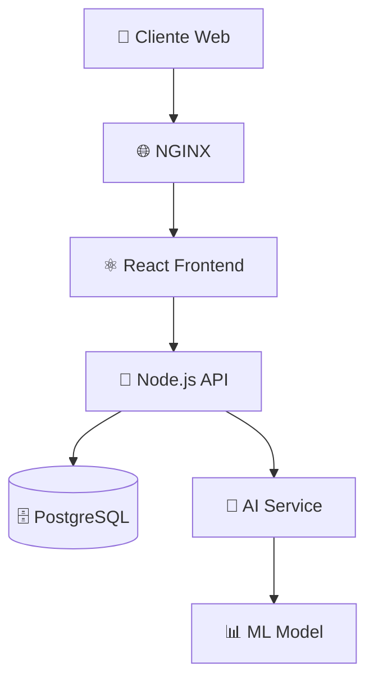

# 🤖 WalletAI Project

<div align="center">


**Sistema de carteira inteligente com categorização automática de transações usando IA**

[](https://opensource.org/licenses/MIT)
[](https://docker.com)
[](https://nodejs.org)
[](https://reactjs.org)
[](https://python.org)

[Demo](#-demo) • [Instalação](#-instalação) • [Documentação](#-documentação) • [Contribuição](#-contribuição)

</div>

## 📋 Sobre o Projeto

O **WalletAI** é uma aplicação full-stack de gerenciamento financeiro pessoal que utiliza inteligência artificial para categorizar automaticamente suas transações. Com uma interface moderna e intuitiva, o sistema oferece insights visuais sobre seus gastos através de gráficos dinâmicos.

### ✨ Funcionalidades Principais

- 🔐 **Autenticação JWT**: Sistema seguro de login e registro
- 💰 **Gestão de Transações**: Criação, edição e exclusão de receitas/despesas
- 🤖 **Categorização Automática**: IA categoriza transações baseada na descrição
- 📊 **Dashboard Visual**: Gráficos interativos de gastos por categoria e histórico
- 📱 **Interface Responsiva**: Design moderno adaptável a diferentes dispositivos
- 🐳 **Docker Ready**: Ambiente completamente containerizado

## 🛠️ Tecnologias Utilizadas

### 🎯 Backend
- **[Node.js 18](https://nodejs.org)** - Runtime JavaScript
- **[Express.js 4.19](https://expressjs.com)** - Framework web minimalista
- **[Prisma ORM 5.15](https://prisma.io)** - ORM moderno para banco de dados
- **[PostgreSQL](https://postgresql.org)** - Banco de dados relacional
- **[JWT](https://jwt.io)** - Autenticação baseada em tokens
- **[bcryptjs](https://github.com/dcodeIO/bcrypt.js)** - Criptografia de senhas

### 🎨 Frontend
- **[React 18.2](https://reactjs.org)** - Biblioteca para construção de interfaces
- **[TypeScript 5](https://typescriptlang.org)** - JavaScript com tipagem estática
- **[Vite 4.2](https://vitejs.dev)** - Build tool moderna e rápida
- **[Styled Components 6.1](https://styled-components.com)** - CSS-in-JS
- **[Chart.js 4.4](https://chartjs.org)** - Biblioteca de gráficos
- **[React Router 6.23](https://reactrouter.com)** - Roteamento declarativo
- **[Axios 1.7](https://axios-http.com)** - Cliente HTTP
- **[Date-fns 3.6](https://date-fns.org)** - Biblioteca de manipulação de datas

### 🧠 AI Service
- **[Python 3.9](https://python.org)** - Linguagem de programação
- **[FastAPI](https://fastapi.tiangolo.com)** - Framework web moderno para APIs
- **[Scikit-learn](https://scikit-learn.org)** - Machine learning
- **[NLTK](https://nltk.org)** - Processamento de linguagem natural
- **[Pandas](https://pandas.pydata.org)** - Manipulação de dados

### 🚀 Infraestrutura
- **[Docker](https://docker.com)** & **[Docker Compose](https://docs.docker.com/compose/)** - Containerização
- **[NGINX](https://nginx.org)** - Servidor web e reverse proxy
- **[Ubuntu/Alpine Linux](https://alpinelinux.org)** - Sistema operacional dos containers

## 🏗️ Arquitetura do Sistema



### 📁 Estrutura de Pastas

```
WalletAI-Project/
├── 📁 backend/                    # API Node.js
│   ├── 📁 src/
│   │   ├── 📁 controllers/        # Controladores da API
│   │   ├── 📁 middlewares/        # Middlewares customizados
│   │   ├── 📁 routes/             # Definição de rotas
│   │   ├── 📁 services/           # Serviços de negócio
│   │   ├── 📁 lib/                # Configurações e utilitários
│   │   └── 📄 server.js           # Servidor principal
│   ├── 📁 prisma/                 # Schema e migrações do banco
│   ├── 📄 package.json
│   └── 🐳 Dockerfile
├── 📁 frontend/                   # Interface React
│   ├── 📁 src/
│   │   ├── 📁 components/         # Componentes reutilizáveis
│   │   ├── 📁 pages/              # Páginas da aplicação
│   │   ├── 📁 contexts/           # Contextos React
│   │   ├── 📁 hooks/              # Hooks customizados
│   │   ├── 📁 services/           # Serviços de API
│   │   ├── 📁 styles/             # Estilos globais
│   │   └── 📁 types/              # Definições TypeScript
│   ├── 📄 package.json
│   ├── 📄 nginx.conf              # Configuração NGINX
│   └── 🐳 Dockerfile
├── 📁 ai-service/                 # Serviço de IA
│   ├── 📄 main.py                 # API FastAPI
│   ├── 📄 categorizer.py          # Lógica de categorização
│   ├── 📄 train.py                # Script de treinamento
│   ├── 📄 requirements.txt
│   └── 🐳 Dockerfile
├── 🐳 docker-compose.yml          # Orquestração dos serviços
├── 📄 Makefile                    # Comandos de automação
├── 📄 .env.example                # Exemplo de variáveis de ambiente
└── 📄 README.md
```

## 🚀 Instalação

### 📋 Pré-requisitos

- **[Docker](https://docs.docker.com/get-docker/)** (versão 20.10+)
- **[Docker Compose](https://docs.docker.com/compose/install/)** (versão 2.0+)
- **[Git](https://git-scm.com/downloads)**
- **[Make](https://www.gnu.org/software/make/)** (opcional, mas recomendado)

### ⚡ Instalação Rápida

```bash
# 1. Clone o repositório
git clone https://github.com/WalletAI-dev/WalletAI-Project.git
cd WalletAI-Project

# 2. Configure as variáveis de ambiente
cp .env.example .env

# 3. Inicie o projeto completo (recomendado)
make start

# OU usando Docker Compose diretamente
docker-compose up --build -d
docker-compose exec backend npx prisma migrate deploy
```

### 🔧 Configuração Manual

Se preferir configurar manualmente cada serviço:

#### Backend
```bash
cd backend
npm install
cp .env.example .env
npx prisma migrate dev
npm run dev
```

#### Frontend
```bash
cd frontend
npm install
cp .env.example .env
npm run dev
```

#### AI Service
```bash
cd ai-service
python -m venv venv
source venv/bin/activate  # Linux/Mac
# venv\Scripts\activate   # Windows
pip install -r requirements.txt
python train.py  # Treinar modelo inicial
python -m uvicorn main:app --reload --port 8000
```

## 🎮 Como Usar

### 🌐 Acessando a Aplicação

Após a instalação, os serviços estarão disponíveis em:

- **Frontend (Interface Web)**: http://localhost:5173
- **Backend (API)**: http://localhost:3333
- **AI Service**: http://localhost:8000
- **PostgreSQL**: localhost:5432

### 👤 Primeiro Acesso

1. **Acesse** http://localhost:5173
2. **Clique** em "Criar conta"
3. **Preencha** seus dados (nome, email, senha)
4. **Faça login** com suas credenciais
5. **Comece** a adicionar suas transações!

### 💰 Adicionando Transações

1. No dashboard, preencha o formulário:
   - **Descrição**: "Compra no supermercado"
   - **Valor**: 150.50
   - **Tipo**: Despesa/Receita
   - **Data**: Selecione a data
2. Clique em **"Adicionar"**
3. A IA automaticamente categorizará sua transação
4. Visualize nos gráficos seus gastos por categoria

## 📊 Demo

### 🖼️ Screenshots

<div align="center">

#### 🔐 Tela de Login


#### 📊 Dashboard Principal


#### 💳 Lista de Transações


</div>

## 🔧 Comandos Úteis

O projeto inclui um **Makefile** com comandos úteis para desenvolvimento:

```bash
make help              # 📋 Mostrar todos os comandos disponíveis
make start             # 🚀 Iniciar todos os serviços
make stop              # 🛑 Parar todos os serviços
make restart           # 🔄 Reiniciar serviços
make logs              # 📝 Ver logs em tempo real
make clean             # 🧹 Limpar containers e volumes
make build             # 🏗️ Rebuildar containers
make shell-backend     # 🖥️ Abrir shell no backend
make shell-frontend    # 🖥️ Abrir shell no frontend
make shell-ai          # 🖥️ Abrir shell no AI service
make migrate           # 🗄️ Executar migrações do banco
```

## 📡 API Documentation

### 🔐 Autenticação

| Método | Endpoint | Descrição |
|--------|----------|-----------|
| `POST` | `/users` | Registrar novo usuário |
| `POST` | `/sessions` | Fazer login |

### 💰 Transações

| Método | Endpoint | Descrição | Auth |
|--------|----------|-----------|------|
| `GET` | `/transactions` | Listar transações do usuário | ✅ |
| `POST` | `/transactions` | Criar nova transação | ✅ |
| `PUT` | `/transactions/:id` | Atualizar transação | ✅ |
| `DELETE` | `/transactions/:id` | Deletar transação | ✅ |

### 🤖 AI Service

| Método | Endpoint | Descrição |
|--------|----------|-----------|
| `POST` | `/categorize` | Categorizar transação por descrição |

### 📝 Exemplo de Requisições

#### Registro de Usuário
```bash
curl -X POST http://localhost:3333/users \
  -H "Content-Type: application/json" \
  -d '{
    "name": "João Silva",
    "email": "joao@example.com",
    "password": "123456"
  }'
```

#### Login
```bash
curl -X POST http://localhost:3333/sessions \
  -H "Content-Type: application/json" \
  -d '{
    "email": "joao@example.com",
    "password": "123456"
  }'
```

#### Criar Transação
```bash
curl -X POST http://localhost:3333/transactions \
  -H "Content-Type: application/json" \
  -H "Authorization: Bearer SEU_TOKEN_JWT" \
  -d '{
    "description": "Compra no supermercado",
    "amount": 150.50,
    "type": "expense",
    "date": "2025-10-05"
  }'
```

## 🧪 Testes

### 🐳 Testes com Docker
```bash
# Executar todos os testes
make test

# Testar apenas o backend
docker-compose exec backend npm test

# Testar apenas o frontend
docker-compose exec frontend npm test
```

### 🔧 Testes Manuais
```bash
# Testar API de saúde
curl http://localhost:3333/health

# Testar AI Service
curl -X POST http://localhost:8000/categorize \
  -H "Content-Type: application/json" \
  -d '{"description": "Compra no supermercado"}'
```

## 🤝 Contribuição

Contribuições são sempre bem-vindas! Aqui está como você pode ajudar:

### 🔄 Processo de Contribuição

1. **Fork** o projeto
2. **Clone** seu fork localmente
3. **Crie** uma branch para sua feature (`git checkout -b feature/AmazingFeature`)
4. **Commit** suas mudanças (`git commit -m 'Add some AmazingFeature'`)
5. **Push** para a branch (`git push origin feature/AmazingFeature`)
6. **Abra** um Pull Request

### 📋 Guidelines

- 🧪 Sempre adicione testes para novas funcionalidades
- 📝 Mantenha a documentação atualizada
- 🎨 Siga os padrões de código do projeto
- 📱 Teste em diferentes dispositivos/navegadores
- 🔒 Nunca commite informações sensíveis

### 🐛 Reportando Bugs

Ao reportar bugs, inclua:
- 🖥️ Sistema operacional
- 🌐 Navegador e versão
- 📋 Passos para reproduzir
- 📸 Screenshots (se aplicável)
- 📝 Logs de erro

## 🚧 Roadmap

### 🎯 Versão 1.1
- [ ] 📱 Progressive Web App (PWA)
- [ ] 🌙 Modo escuro/claro
- [ ] 📊 Mais tipos de gráficos
- [ ] 📧 Notificações por email
- [ ] 🏷️ Tags personalizadas

### 🎯 Versão 1.2
- [ ] 💳 Integração com bancos
- [ ] 🎯 Metas financeiras
- [ ] 📈 Relatórios avançados
- [ ] 👥 Compartilhamento de despesas
- [ ] 🌍 Múltiplas moedas

### 🎯 Versão 2.0
- [ ] 📱 App mobile (React Native)
- [ ] 🤖 IA mais avançada
- [ ] ☁️ Backup em nuvem
- [ ] 🔄 Sincronização multi-dispositivo

## 📄 Licença

Este projeto está licenciado sob a **MIT License** - veja o arquivo [LICENSE](LICENSE) para detalhes.

```
MIT License

Copyright (c) 2025 WalletAI Project

Permission is hereby granted, free of charge, to any person obtaining a copy
of this software and associated documentation files (the "Software"), to deal
in the Software without restriction, including without limitation the rights
to use, copy, modify, merge, publish, distribute, sublicense, and/or sell
copies of the Software, and to permit persons to whom the Software is
furnished to do so, subject to the following conditions:

The above copyright notice and this permission notice shall be included in all
copies or substantial portions of the Software.

THE SOFTWARE IS PROVIDED "AS IS", WITHOUT WARRANTY OF ANY KIND, EXPRESS OR
IMPLIED, INCLUDING BUT NOT LIMITED TO THE WARRANTIES OF MERCHANTABILITY,
FITNESS FOR A PARTICULAR PURPOSE AND NONINFRINGEMENT. IN NO EVENT SHALL THE
AUTHORS OR COPYRIGHT HOLDERS BE LIABLE FOR ANY CLAIM, DAMAGES OR OTHER
LIABILITY, WHETHER IN AN ACTION OF CONTRACT, TORT OR OTHERWISE, ARISING FROM,
OUT OF OR IN CONNECTION WITH THE SOFTWARE OR THE USE OR OTHER DEALINGS IN THE
SOFTWARE.
```

## 👥 Autores

- **Igor** - *Desenvolvedor Principal* - [@igor](https://github.com/igor)
- **Marcio** - *Product Owner* - [@marcio](https://github.com/marcio)

## 🙏 Agradecimentos

- **[OpenAI](https://openai.com)** - Inspiração para recursos de IA
- **[Docker](https://docker.com)** - Containerização simplificada
- **[Prisma](https://prisma.io)** - ORM excepcional
- **[Vercel](https://vercel.com)** - Deploy e hospedagem
- **Comunidade Open Source** - Pelo suporte e feedback

---

<div align="center">

**⭐ Se este projeto te ajudou, deixe uma estrela!**

[](https://github.com/WalletAI-dev/WalletAI-Project/stargazers)
[](https://github.com/WalletAI-dev/WalletAI-Project/network/members)

**Feito com ❤️ e ☕ pela equipe WalletAI**

</div>